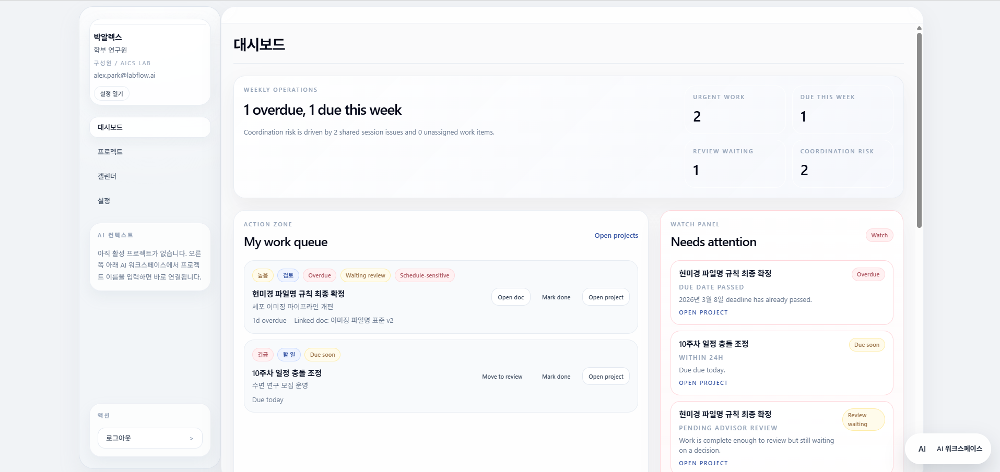
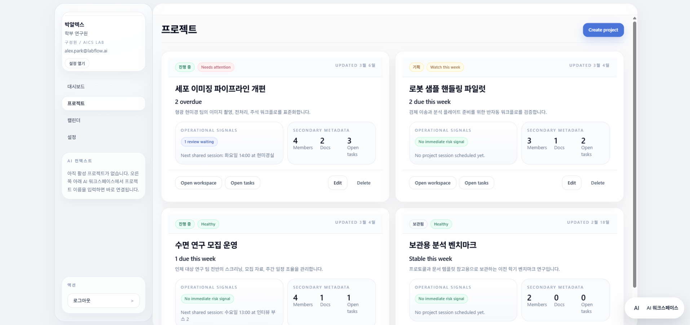
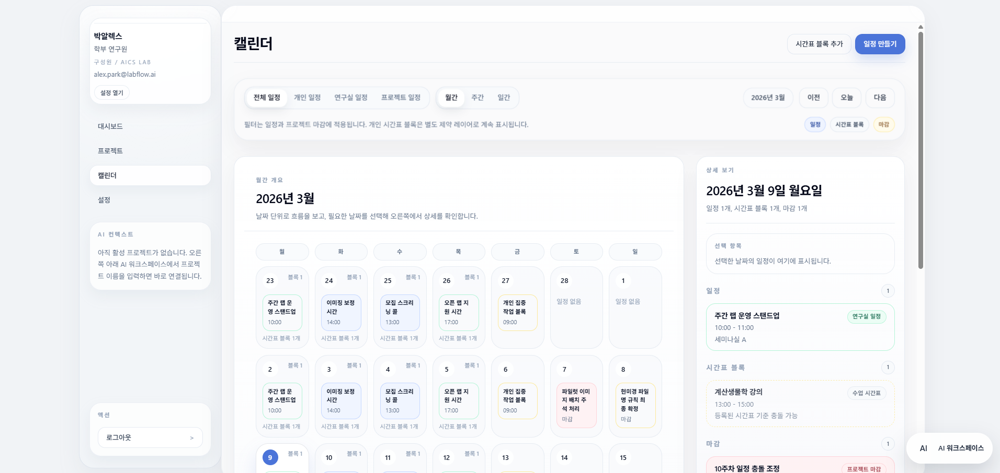
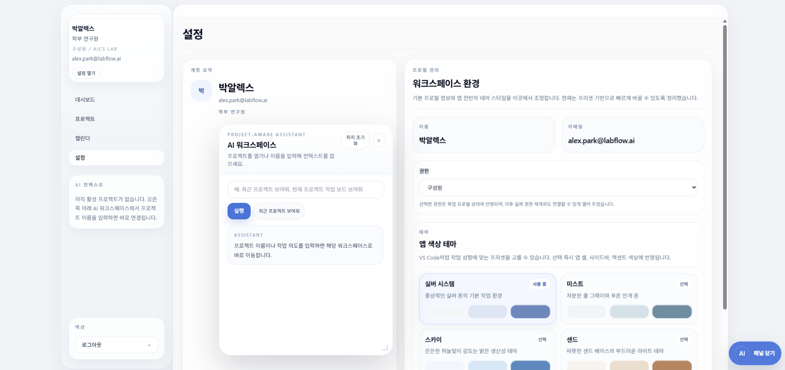

# AICS-Tool Frontend MVP

React, TypeScript, Vite, Tailwind CSS 기반의 연구실 워크플로 제품 프론트엔드입니다.  
프로젝트, 문서, 작업, 일정, 시간표 제약을 하나의 앱 셸 안에서 다루며, 우측 하단 `AI 워크스페이스`를 통해 자연어 기반 화면 이동과 일부 액션 실행을 지원합니다.

## 1. 실행 방법

### 요구 사항
- Node.js 20 이상
- npm 10 이상

### 의존성 설치
```bash
npm install
```

### 환경 변수
루트에 `.env` 파일을 두고 아래 값을 설정합니다.

```env
API_KEY=...
FACTCHAT_MODEL=gpt-5.4
# 선택
# FACTCHAT_BASE_URL=https://factchat-cloud.mindlogic.ai/v1/gateway
```

- `API_KEY` 또는 `FACTCHAT_API_KEY`가 없으면 `/api/assistant/chat`는 서버에서 바로 실패하고, 프런트는 로컬 fallback 규칙으로만 동작합니다.
- `FACTCHAT_MODEL` 기본값은 코드상 `claude-sonnet-4-6`이지만 현재 프로젝트에서는 `gpt-5.4` 기준 구성이 반영되어 있습니다.

### 개발 서버 실행
```bash
npm run dev
```

기본 접속 주소:
- 프런트: `http://localhost:5173`
- Node 서버: `http://localhost:8787`
- 헬스 체크: `http://localhost:8787/api/health`

### 개별 실행
```bash
npm run dev:client
npm run dev:server
```

### 프로덕션 빌드
```bash
npm run build
```

### 서버 실행
```bash
npm run serve
```

## 2. 주요 화면

### 대시보드
- 이번 주 기준의 운영 화면입니다.
- 긴급 작업, 임박한 마감, 리뷰 대기, 조율 리스크를 우선적으로 보여줍니다.
- 내 작업 큐에서 프로젝트와 문서 맥락으로 바로 이동할 수 있습니다.



### 프로젝트 목록
- 프로젝트를 단순 목록이 아니라 운영 상태 중심으로 보여줍니다.
- 마감 임박 작업, 리뷰 대기, 차단 작업, 다음 공유 세션 같은 신호를 카드에서 확인할 수 있습니다.

### 프로젝트 상세
- 프로젝트 상태를 중심으로 개요, 문서, 작업, 일정, 멤버 섹션이 이어집니다.
- 다음 마일스톤, 지연 작업, 이번 주 작업, 리뷰 대기, 차단 상태, 공유 일정을 한 화면에서 확인할 수 있습니다.



### 작업 보드
- 상태 변경과 일괄 작업을 빠르게 처리하는 작업 중심 보드입니다.
- 삭제 확인, 우선순위/마감/담당자/문서 연결 변경을 지원합니다.

### 캘린더
- 월간, 주간, 일간 뷰를 분리했습니다.
- 일정과 시간표 블록을 함께 표시하며, 우측 상세 패널에서 선택 항목을 확인합니다.



### 설정
- 사용자 정보, 권한, 테마, 로그아웃을 관리합니다.



## 3. AI 워크스페이스

AI 워크스페이스는 로그인 이후 공통 레이아웃 안에서 동작하는 글로벌 패널입니다.  
현재 구현은 두 층으로 구성됩니다.

- 1차: `/api/assistant/chat`로 서버 요청
- 2차: 서버 응답이 비어 있거나 `action`이 없을 때 로컬 해석기 fallback 실행

즉, LLM 응답이 불완전해도 프로젝트 이동 같은 핵심 동작은 프런트에서 한 번 더 보정합니다.

### 현재 가능한 동작

#### 전역 페이지 이동
- `대시보드 열어줘`
- `프로젝트 목록 보여줘`
- `캘린더로 이동해줘`
- `설정 페이지 열어줘`

#### 프로젝트 컨텍스트 이동
- `세포 이미징 파이프라인 개편 열어줘`
- `현재 프로젝트 작업 보드 보여줘`
- `이 프로젝트 일정 열어줘`
- `세포 이미징 파이프라인 개편 멤버 보여줘`

#### 문서 열기
- `이미징 파일명 표준 v2 열어줘`
- `현재 프로젝트 문서 보여줘`

#### 생성/상태 변경
- 작업 생성
- 문서 생성
- 일정 생성
- 작업 상태 변경
- 작업/문서 삭제 전 확인

#### 앱 액션
- `미스트 테마로 바꿔줘`
- `스카이 테마 적용`
- `로그아웃해줘`

### 현재 지원하지 않는 범위
- 외부 웹페이지 열기
- 임의 URL 브라우저 이동
- 시스템 명령 실행

즉, `AI 워크스페이스`는 현재 "앱 내부 오케스트레이션"까지를 목표로 합니다.

### 동작 방식
- 프로젝트명이 명확하면 해당 프로젝트 컨텍스트를 활성화하고 바로 이동합니다.
- 문서명이 명확하면 문서 상세 라우트까지 직접 이동합니다.
- 비슷한 후보가 여러 개면 제안 목록을 보여줍니다.
- `현재 프로젝트`, `이 프로젝트` 같은 표현은 활성 컨텍스트 기준으로 해석합니다.
- LLM이 `message`만 반환하고 `action`을 빠뜨려도, 프런트 로컬 규칙이 다시 경로를 계산해 이동을 보정합니다.

### 저장되는 컨텍스트 상태
- `activeProjectId`
- `activeDocumentId`
- `recentProjectIds`

### 관련 파일
- `src/app/layouts/app-layout.tsx`
- `src/app/store/use-lab-store.ts`
- `src/features/assistant/assistant-api.ts`
- `src/features/assistant/assistant-workspace-panel.tsx`
- `src/features/assistant/mock-project-assistant.ts`
- `server.mjs`

### 테스트용 문서
- `docs/ai-workspace-activity-examples.md`
- `docs/ai-workspace-test-prompts.md`

## 4. 전환 모션

현재 앱 셸에는 다음 전환이 반영되어 있습니다.

### 메인 패널 전환
- 사이드바 메뉴를 기점으로 하이라이트가 메인 패널로 확장되는 `Nav Origin Expand`
- 이전 화면은 살짝 축소되고 blur/fade-out
- 새 화면은 scale-up 후 안착하는 `Depth Layer` 기반 전환

### AI 워크스페이스 패널 전환
- 우측 하단 버튼 위치를 기준으로 패널이 열리고 닫힙니다.
- 버튼 위치에서 패널이 뽑혀 나오듯 열리고, 닫을 때는 다시 버튼으로 빨려들어가듯 수축합니다.

관련 스타일은 `src/index.css`에 정의되어 있습니다.

## 5. 라우트

- `/login`
- `/dashboard`
- `/projects`
- `/projects/:projectId`
- `/projects/:projectId/docs`
- `/projects/:projectId/docs/:docId`
- `/projects/:projectId/tasks`
- `/projects/:projectId/schedule`
- `/projects/:projectId/members`
- `/calendar`
- `/settings`

## 6. 파일 구조

```text
AICS-Tool/
|-- public/
|-- docs/
|   |-- ai-workspace-activity-examples.md
|   |-- ai-workspace-test-prompts.md
|   |-- llm-dynamic-context-template.txt
|   |-- llm-project-context-architecture.md
|   |-- llm-system-prompt.txt
|   `-- llm-tool-schema-example.json
|-- src/
|   |-- app/
|   |   |-- layouts/
|   |   |   `-- app-layout.tsx
|   |   |-- store/
|   |   |   `-- use-lab-store.ts
|   |   `-- App.tsx
|   |-- entities/
|   |   `-- models.ts
|   |-- features/
|   |   |-- assistant/
|   |   |   |-- assistant-api.ts
|   |   |   |-- assistant-workspace-panel.tsx
|   |   |   `-- mock-project-assistant.ts
|   |   |-- auth/
|   |   |-- calendar/
|   |   |-- documents/
|   |   |-- projects/
|   |   `-- tasks/
|   |-- mock/
|   |   `-- data.ts
|   |-- pages/
|   |   |-- login-page.tsx
|   |   |-- dashboard-page.tsx
|   |   |-- projects-page.tsx
|   |   |-- project-detail-page.tsx
|   |   |-- document-page.tsx
|   |   |-- task-board-page.tsx
|   |   |-- calendar-page.tsx
|   |   |-- settings-page.tsx
|   |   `-- not-found-page.tsx
|   |-- shared/
|   |   |-- lib/
|   |   `-- ui/
|   |-- index.css
|   `-- main.tsx
|-- server.mjs
|-- index.html
|-- package.json
|-- postcss.config.js
|-- tailwind.config.ts
|-- tsconfig.app.json
|-- tsconfig.json
`-- vite.config.ts
```

## 7. NPM 스크립트

- `npm run dev`: 프런트와 Node 서버를 동시에 실행
- `npm run dev:client`: Vite 프런트만 실행
- `npm run dev:server`: Node 서버만 실행
- `npm run build`: TypeScript 검사 후 프로덕션 번들 생성
- `npm run preview`: Vite preview 실행
- `npm run serve`: 빌드 결과를 Node 서버로 제공

## 8. 참고 사항

- 데이터는 기본적으로 `src/mock/data.ts`의 목업 데이터를 사용합니다.
- Zustand `persist`가 켜져 있으므로 브라우저 로컬 상태가 남아 있을 수 있습니다.
- AI 워크스페이스는 실제 LLM 호출과 로컬 fallback 규칙을 함께 사용합니다.
- 서버 쪽 LLM 프록시는 `server.mjs`에 구현되어 있으며, `/api/assistant/chat`와 `/api/health`를 제공합니다.
